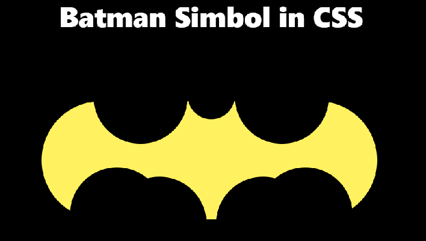
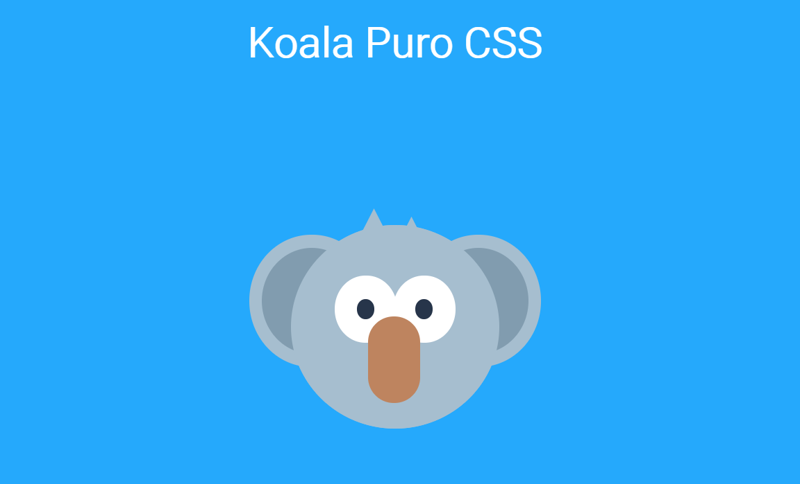

# Drawing using CSS

## Objective

1. Test my conhecimento in CSS

2. Studying CSS more deep,using SASS.

3. Apply what learned the CSS in a project.

#

## 01-Batman Simbol in CSS

#

## 02-Koala in CSS

